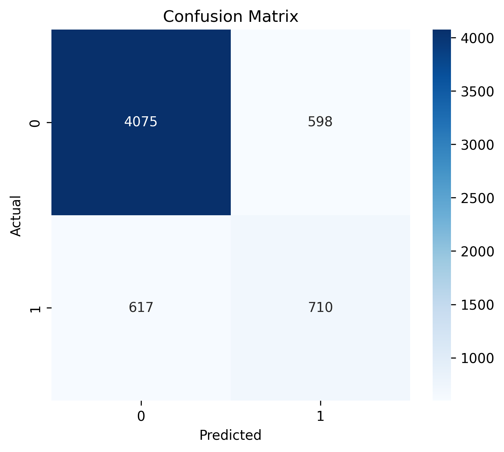
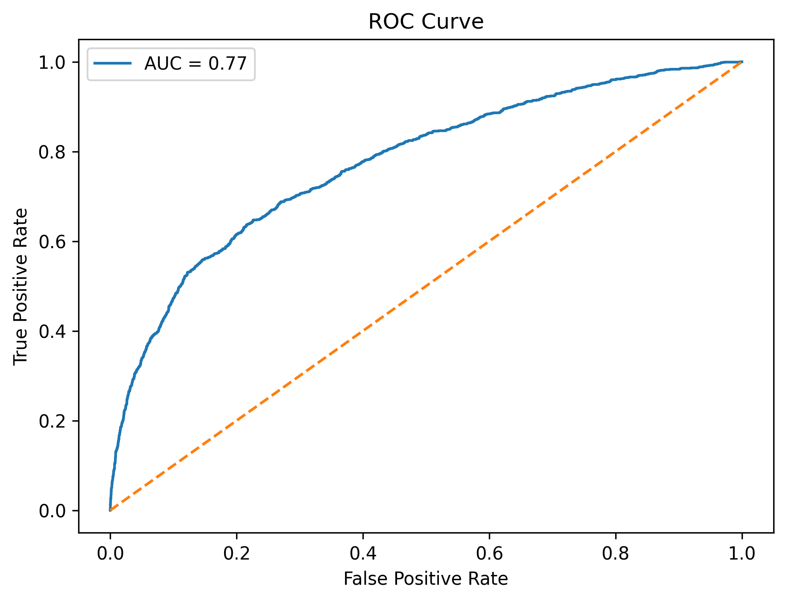
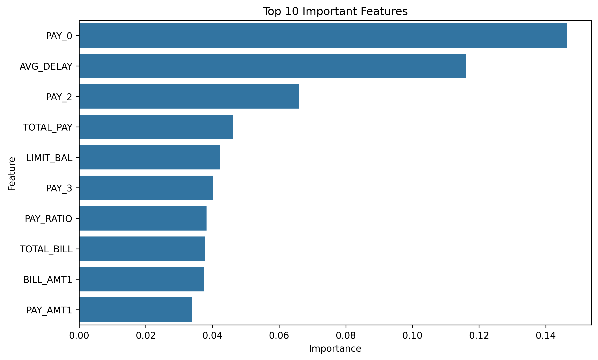

# Credit Card Default Prediction

Bu proje, Veri Madenciliği dersi kapsamında geliştirilmiştir. Çalışmada UCI Machine Learning Repository üzerinde bulunan **Default of Credit Card Clients** veri seti kullanılarak kredi kartı müşterilerinin gelecek ay temerrüde düşüp düşmeyecekleri tahmin edilmiştir.

## Kullanılan Teknolojiler

- Python
- Pandas
- NumPy
- Matplotlib
- Seaborn
- Scikit-Learn

## Veri Seti

- 30.000 müşteri kaydı
- 25 özellik
- Hedef değişken: `default payment next month`

Amaç, müşterilerin ödeme geçmişleri ve finansal bilgileri kullanılarak kredi kartı temerrüt riskini tahmin etmektir.

## Proje Aşamaları

- Veri Seti Analizi (EDA)
- Veri Ön İşleme
- Özellik Mühendisliği
- Random Forest Modeli
- Hiperparametre Optimizasyonu
- Model Performans Değerlendirmesi

## Oluşturulan Özellikler

- AVG_DELAY
- TOTAL_BILL
- TOTAL_PAY
- PAY_RATIO

Bu özellikler model performansını artırmak amacıyla oluşturulmuştur.

## Sonuçlar

| Metrik | Değer |
|---------|---------|
| Accuracy | %80 |
| ROC-AUC | 0.77 |
| Precision | 0.54 |
| Recall | 0.54 |
| F1-Score | 0.54 |

## Önemli Değişkenler

Model tarafından en önemli bulunan değişkenler:

1. PAY_0
2. AVG_DELAY
3. PAY_2
4. TOTAL_PAY
5. LIMIT_BAL

## Görseller

### Confusion Matrix

### ROC Curve

### Feature Importance

## Proje Dosyaları

- `final_project.ipynb` → Notebook dosyası
- `data/` → Veri seti
- `images/` → Oluşturulan grafikler

## Video Sunumu

YouTube:
https://www.youtube.com/watch?v=oHtddNVnDZc

## Geliştirici

**Elif Nur Beycan**

Bursa Teknik Üniversitesi  
Bilgisayar Mühendisliği
